# Simple Worked Example

## Finished Product

This example is designed to show you how to start creating simple content and then apply more advanced DAX. With a working knowledge of HTML and CSS, you will be able to get very creative. On this page, we'll get into the basics of creating HTML-based columns and measures.

The sample workbook is shown below, and you can navigate through the pages to see our example built step by step. You can [download the sample workbook here](/pbix/HTML-Content-Data-Model-Walkthrough-2.0.pbix) if you want to do your own thing.

---

<div align="center">
<iframe title="HTML-Content-Data-Model-Walkthrough-2.0" width="800" height="636" src="https://app.powerbi.com/view?r=eyJrIjoiNjFiNzQyMmUtYTE0OS00MTk0LWI4NWYtYTc1MzUzOWRlZGI1IiwidCI6IjUzYmJlMGQ3LTU0NzItNGQ0NS04NGY0LWJiNzJiYjFjMjI4OSJ9" frameborder="0" allowFullScreen="true"></iframe>
</div>

---

:::warning Regarding Image URLs in Our Example
For our example (and for simplicity), **we are using the [regular (uncertified) edition](visual-editions#regular) of HTML Content**. This can access image URLs by their web address, provided that they are publicly available and not subject to any cross-domain restrictions on the third-party site.

Your mileage may vary if using the [certified edition](visual-editions#lite-certified) due to these restrictions. As such, you may need to consider using a [data URL](https://developer.mozilla.org/en-US/docs/Web/URI/Reference/Schemes/data) in place of a direct resource URL.
:::

## Sample Data

We'll start off with some simple data from our model:

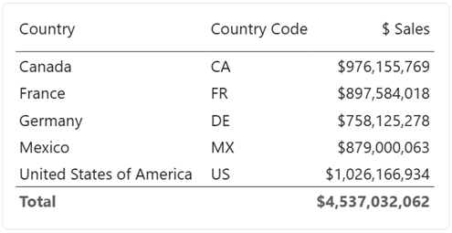

The `[Country]` and `[Country Code]` columns are fields from our data model, and `[$ Sales]` is a simple `SUM()` measure that calculates total sales for the current row context.

## Making the Country Flag

Let's say we want to represent the country with its flag using some images we have stored on the HTML Content website. We can create a calculated column as follows:

```dax
<HTML> Country Flag 16px =
   ""
```

:::note Use A Sensible Semantic Modeling Approach
Note that the column doesn't have to have the `<HTML>` prefix. It's good practice to prefix names with units to denote the type of value they return, like a `$`, `#`, etc. This is my preferred prefix to indicate that the object returns HTML when inspected in model view.
:::

We can now add this to the HTML Content visual's **Values** data role, and we'll see a flag for each value of `Demographic[Country Code]`, e.g.:


:::note DAX and Double Quotes
Note that while conventional HTML might use double quotes (`"`) for attribute values, these need to be escaped in DAX by using `""` for every occurrence of a double quote character. This can be tricky to keep track of in more advanced use cases.

Because single quotes are valid in the W3C HTML specification, I'll use this format going forward to make my example DAX code easier to manage. If you do want to use double quotes, the above could also be written as:

```dax
<HTML> Country Flag 16px =
   ""
```

:::

## Sales Summary

Now, we perhaps want to enrich this with the total sales for each country. To do this, we need the values of `[$ Sales]` from our model.

To combine a raw measure value with a column and produce combined HTML, we will need to use a measure instead. The visual allows us to add a measure, but if we do, then there is no longer any row context for each individual value, e.g.:


There are two options available for introducing this into your design:

1. Use the **Context** data role to create row context.
2. Encapsulate the data within a single measure and add this to **Values**.

The first offers a faster way in for simple use cases, and (as of 2.0) can provide flexibility for additional content and [interactivity](interactivity) via [templates](properties-templates). The second was the way of building richer content prior to 2.0 and is still very widely used, but we'll stick with the first approach (Context) for our example and you can decide what works best for you after you've been introduced to the concept.

## Context {#option-1-create-context-using-granularity}

### Adding Context

As we wish to display results for each country, we can add a column to the **Context** data role that matches the grain of the country flag HTML. Here, we'll use `[Country]` for this:

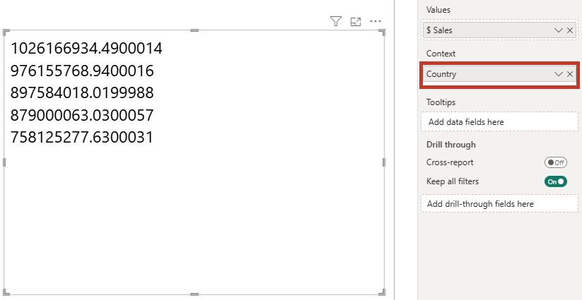

Here we can see that this has introduced row context at the `[Country]` level and now displays the total sales for each country. You can add multiple columns into this data role to increase the level of granularity, but that sales measure isn't looking very exciting, so we will write a new one to combine our flag with `[$ Sales]`:

```dax
<HTML> Sales by Country (Simple, Context) =
    VAR FormattedSales =
        FORMAT ( [$ Sales], "$#,##0" )
    VAR CountryFlag =
        SELECTEDVALUE ( Demographic[<HTML> Country Flag 16px] )
    RETURN
        CountryFlag
        & "&nbsp;"
        & FormattedSales
```


### Exploring Context

As mentioned above, the **Context** data role is useful for breaking out our data, but it can also influence how Power BI interactivity works. By default, anything added to the role is included in tooltip functionality. Other measures can be added to the **Tooltips** role to flesh this out, e.g.:

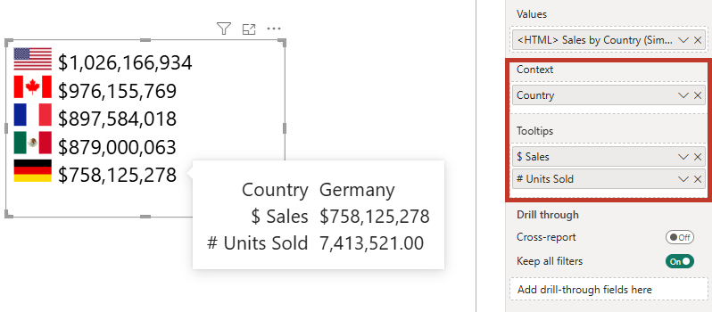

Report page tooltips are also supported for the created context on a data point.

Columns in the **Context** role can also give us the ability to cross-filter other visuals if we enable the option in the _Cross-filtering_ property menu and click on a row, e.g.:

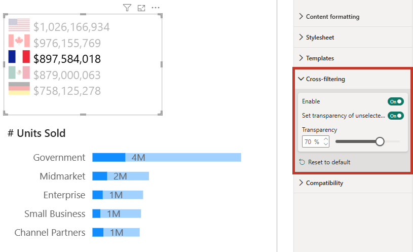

There's a lot more to interactivity than this. While HTML Content tries to make this as simple as possible, you can control many more facets of how interactivity works, including styling the appearance and suppressing specific functions on certain elements. Refer to the [interactivity](interactivity) page for more information on this and how to better understand how Power BI interactivity works (and where your limits may lie).

## Rendered Output

So far, we've added a simple measure containing HTML, which is then projected out for each row in the data set. But let's have a look at what HTML Content actually does in terms of what it puts into the output domain.

### Finding Template Properties

In the properties pane, expand the _Templates_ tab, and you'll see two properties:

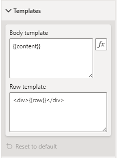

- **Body template**, which shows a `{{content}}` placeholder.
- **Row template**, which shows a `{{row}}` placeholder surrounded by a `<div>` element.

These are set up to provide bare minimum pass-through from your semantic model, but they can be customized quite extensively to create flexible layouts. You can read more about this in detail on the [Templates](properties-templates) page, or continue reading where we'll change them slightly for this example to see how they work.

### Checking Generated HTML

Because Power BI doesn't provide the same development environment as a web browser, it can often be difficult to check the generated output. As such, HTML Content provides two options you can use to verify how this is generated from your data and configuration. Both are available in the _Content formatting_ property pane (under _Behavior_):

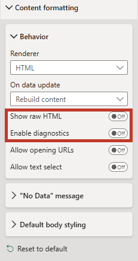

1. [**Show raw HTML**](properties-content-formatting#show-raw-html), which will display the HTML instead of the rendered visual, e.g.:

   

2. [**Enable diagnostics**](diagnostics), which provides you with the means to be able to see your rendered output but click and see your HTML in a separate dialog, via the 🐞 icon available in the top-right of the visual.

   

:::info Row Classes
The `htmlViewerEntry` class is added by HTML Content when your data is processed to help identify where a new data point is rendered. It is added to the outermost element in each row's specific DOM subtree.
:::

## Enriching Our Design

We'll think of a couple of extra advantages of HTML Content to make our visual a little richer, while keeping its functionality. Rather than displaying as a raw set of div elements for each row, we'll turn it into a basic table with a little additional styling.

### Body Template

Firstly, we'll need to update our _Body template_ to have the surrounding elements, and we can modify this as follows:


Note that the `{{content}}` token is in the `<tbody>` tag, and this is where our data will be rendered.

:::tip Prefer dynamic content here, too?
This property supports conditional formatting, which means we could do this as a measure if we wanted to, but in this example we're just typing straight in.
:::

For your reference, the HTML is below, so you can copy and paste this into the property or a suitable measure (remember to escape double quotes if you do this!).

```html
<table>
  <thead>
    <tr>
      <th></th>
      <th class="numeric-value">$ Sales</th>
    </tr>
  </thead>
  <tbody>
    {{content}}
  </tbody>
</table>
```

### Our New Contextual Measure

For each data point delivered via row context, we're going to change the template from the default because `<div>`s don't always work so well inside semantic HTML tables. Here, we will do most of the work in our measure. We'll set up a new measure as follows:

```dax
<HTML> Sales by Country (Table Row) =
    VAR FormattedSales =
        FORMAT ( [$ Sales], "$#,##0" )
    VAR CountryFlag =
        SELECTEDVALUE ( Demographic[<HTML> Country Flag 16px] )
    RETURN
          "<tr>"
        &   "<td>" & CountryFlag & "</td>"
        &   "<td class=""numeric-value"">" & FormattedSales & "</td>"
        & "</tr>"
```

Replace our current measure in the **Values** data role with this one, e.g.:

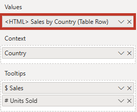

### Row Template

As we opted to handle everything that gets rendered for a contextual data point, for this specific property we will just replace the default entry with the `{{row}}` token:


:::info Why no conditional formatting?
This property doesn't support conditional formatting because supplying a measure via context is essentially the same thing.
:::

### Review of Template Work

Let's take a quick look at where we've got to. Provided we've set the templates up and we've added our new measure into the visual, we should see something that looks like this:

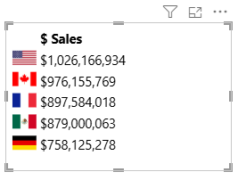

We might know there's a table underneath, but we should really do some work with the styling.

### Stylesheet

Our properties menu contains a [**Stylesheet** pane](properties-stylesheet), and in here we can paste a CSS style sheet or add one from our semantic model via conditional formatting, e.g.:

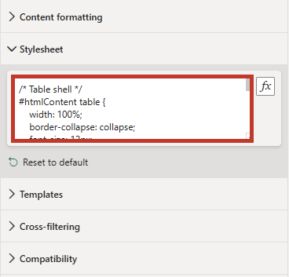

Our CSS is as follows:

```css
/* Table shell */
#htmlContent table {
  width: 100%;
  border-collapse: collapse;
  font-size: 12px;
  border-radius: 8px;
  overflow: hidden;
}

/* Header cells */
#htmlContent thead th {
  background: #888;
  color: #fff;
  font-weight: 600;
  text-align: left;
  padding: 4px;
}

/* Columns displaying numbers */
#htmlContent .numeric-value {
  text-align: right;
}

/* Body cells */
#htmlContent tbody td {
  padding: 2px;
  border-bottom: 1px solid #eaeaea;
}

/* Body row hover effect */
#htmlContent tbody tr.htmlViewerEntry:hover {
  background: #eaeaea;
}
```

### Final Inspection

Now with our style sheet applied, we can take a look at how this appears on the report canvas, e.g.:

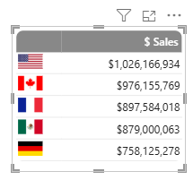

## Wrapping Up

We now have a compact table that is styled and also has a slight hover effect as we go over a row and still honors our interactivity. Tooltips can be displayed and cross-filtering still works:

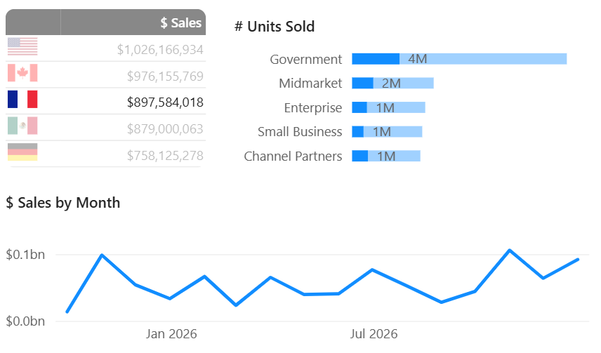

This should give you a small taste of what is possible with HTML Content, but please read on further to understand more about the features and how you might be able to use them to build your own bespoke interactive designs in Power BI.
