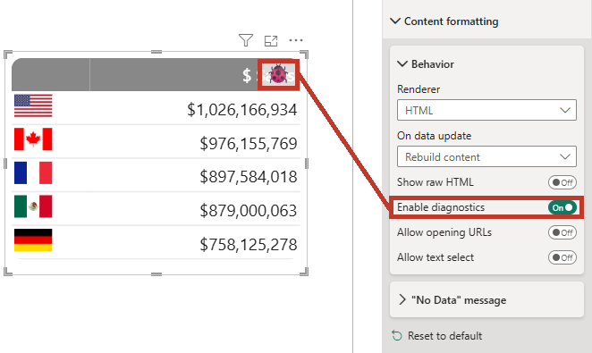
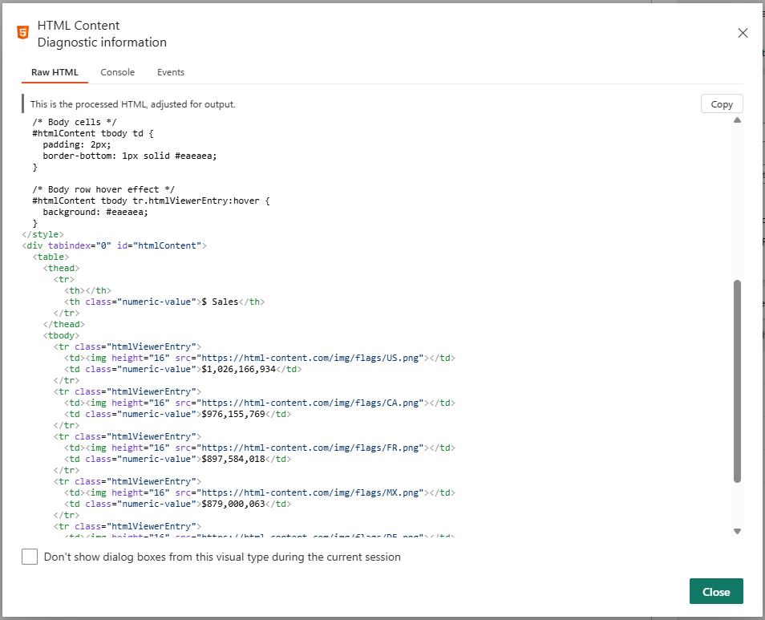
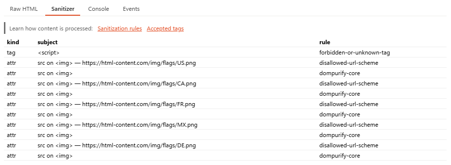
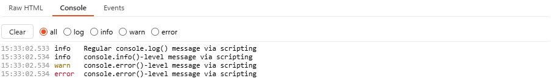
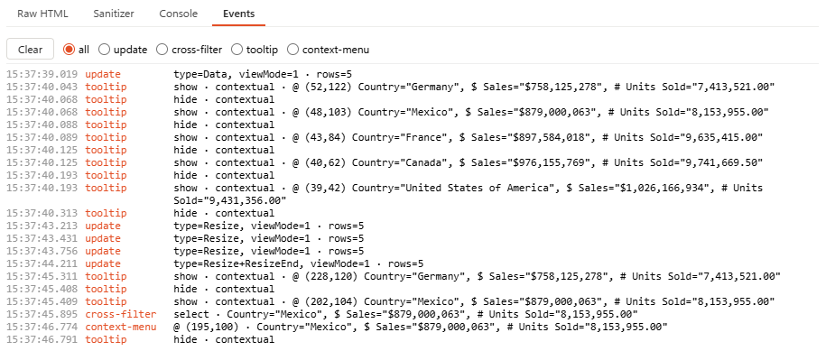

# Diagnostics

:::info New in 2.0
Diagnostics were added in version 2.0. Refer to the [change log](change-log) for full release details.
:::

Power BI Desktop has no browser dev tools, so the visual provides its own diagnostics surface for authors. It is **off by default** - turn on [**Content formatting → Enable diagnostics**](properties-content-formatting#enable-diagnostics).

While you are **editing** a report in Power BI **Desktop or Service**, a small diagnostics icon appears on the visual (or press **Ctrl/Cmd + D**). It opens the **Diagnostic information** dialog.

The toggle persists with the report, but the icon and the capture are active **only** in edit mode on a host that supports dialogs. Report consumers never see them and incur none of the debugging overheads that occur during edit mode.

## Raw HTML {#raw-html-tab}

The processed HTML the visual actually rendered (adjusted for output, and sanitized in the Secure edition), with a **Copy** button.

Large output degrades gracefully to stay responsive: above ~200 KB it is shown as plain (un-highlighted) text, and above ~512 KB it is truncated and no longer pretty-print-indented - so multi-megabyte content shows a bounded prefix rather than freezing the dialog. The in-canvas [Show raw HTML](properties-content-formatting#show-raw-html) property shows the same processed HTML with the same caps.

## Sanitizer 🛡️ {#sanitizer-tab}

_HTML Content Secure only._ A table of what the sanitizer removed and which rule applied (kind/subject/rule), with links to the [Sanitization](sanitization) and [Accepted Tags](accepted-tags) documentation. If content you expected is missing from the output, this tab tells you exactly what was stripped and why.

:::info This tab does not appear in the Regular edition
Nothing is stripped, so there is nothing to report.
:::

## Console {#console-tab}

Script and visual console output captured while diagnostics is active, with a **Clear** button and a log-level filter (**all** or one level). This is the main debugging surface when [scripting in the Regular edition](scripting).

:::info Console logging is durable across updates
Because many events can happen on your canvas, console logging behaves much like it does in browser development tools. So, as your visual receives updates (or updates itself), new console log messages are not removed, but you can clear them if it gets too busy. Logging begins when your visual is created on the canvas and ends when it is destroyed.
:::

## Events {#events-tab}

A log of host events captured while diagnostics is active:

- Each visual **update**, with the update type and view mode - so you can see when and why the visual re-rendered.
- **Cross-filter** clicks (add/remove/clear).
- **Tooltip** show/hide. Tooltips can show as one of:
  - `contextual` - valid [row context can be derived](interactivity#contextual-tooltip-binding) and report page tooltips or modern tooltip actions will work.
  - `standard` - this was invoked using [manual binding attributes](interactivity#manual-independent-tooltip-binding) and does not contain contextual information for other Power BI interactivity.
- **Context-menu** (right-click) actions.

Each entry provides simple context where applicable (the cursor coordinates, discovered datum for row context, etc.). Filter by type (**all** or one type), then **Clear** to reset.

Much like the [console tab](#console-tab), event logging is durable for the lifetime of your visual on the canvas, until you clear it.
