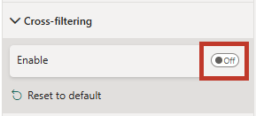
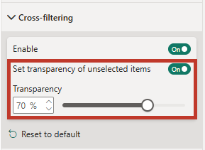
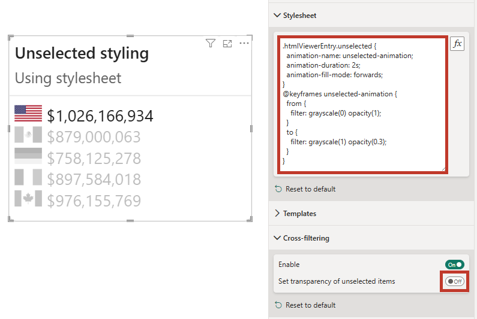

# Interactivity

## A General Note About Power BI Interactivity

Before we begin, it's worth covering how Power BI manages interactivity, so that expectations are set. A visual receives a summarized dataset from Power BI, based on the fields you add to its [data roles](data-roles) - one row per unique combination of column values, plus any measures evaluated at that grain. The visual can't read anything else from the model, and it can't write anything back: to display a report page tooltip, drill through, or cross-filter, it has to ask Power BI to act on its behalf, and Power BI will only do so if it can reconcile the element you interacted with back to a row in that dataset. Visuals don't have much control over this behavior, so we have to work with what we've got. These challenges and limitations are <a href="https://deneb-viz.github.io/docs/interactivity-overview" target="_blank">covered in pretty decent detail over on Deneb's website</a> if you want to understand them in more depth; we'll keep things brief here so that you can digest what you will and will not be able to do with these features.

In practical terms, then, interactivity comes down to whether the visual's dataset contains rows that Power BI can reconcile. With HTML Content, this gives us two distinct architectural approaches to delivering a solution:

### 1. Using Context

> **Values** (for the HTML) and **Context** to create row or measure context

Using the [**Context**](data-roles#granularity) data role creates suitable row and/or measure context that Power BI interactivity can understand. With a single measure, Power BI only has a single value as its context, which doesn't include things like row context. As such, you will be limited in what you can do, but we've tried to provide some help where we can (and will point this out below where it can benefit).

Adding a column (for row context) or a measure (or a combination of either), will attempt to resolve a Power BI tooltip over each data point. Note that:

- Row context creates one data point per your dataset's granularity (each unique combination of column values).
- If using measures only, this will be a single data point with the context of any measures you add to the data role.
- Mixing both columns and measures will create a context with the appropriate intersection of columns and measures.

### 2. Using One Giant Measure

> **Values** only

Here, you are only rendering content: the dataset contains no rows that Power BI can reconcile individual data points against, so your options are limited.

:::tip Consider Revisiting This Approach in >= 2.0
With the introduction of [Templates](properties-templates), you may no longer need to do this and you may be able to open up interactivity scenarios previously considered impossible to deliver.
:::

---

With this in mind, let's dig into how you can deliver interactivity in your reports.

## Tooltips

Firstly, we have Power BI tooltip functionality. You have two approaches here:

### Contextual Tooltip Binding

The simplest approach is to add fields to the [**Tooltips**](data-roles#tooltips) data role: when you hover over the element representing a data row, HTML Content asks Power BI to display a tooltip for that data point. As such, if you use a single measure for your HTML output, then you will only be able to display a single tooltip for your visual, unless you use [Manual (Independent) Tooltip Binding](#manual-independent-tooltip-binding). Note that:

- For report page tooltips (or modern tooltips), the fields in the **Context** role are used to reconcile a data point to a tooltip page or drillthrough action, and this intersection of fields is what each data point supplies when that functionality is invoked.
- For standard tooltips, all fields added to the **Context** and **Tooltips** roles will be included by default.
- Additionally, fields added to **Context** and **Tooltips** roles can be accessed in a <a href="https://learn.microsoft.com/en-us/power-bi/visuals/power-bi-visualization-visual-tooltips#use-sentence-format" target="_blank">sentence format</a> tooltip template.

:::tip Data Row Element Hover State
When a data row element is hovered over with the mouse, HTML Content will apply a class of **`hover`** to it. You can apply a suitable selector to the stylesheet measure to style these events. Note that using the **`:hover`** [pseudo class](https://developer.mozilla.org/en-US/docs/Web/CSS/Pseudo-classes) will work as well.
:::

### Manual (Independent) Tooltip Binding

If you prefer to use a single measure, you may not benefit from some of the above enhancements, particularly as report page tooltips rely on row context to display them for the user. However, if you are building the ultimate visual purely from HTML and a single measure, there is some help at hand: you can specify elements in your design that should trigger standard Power BI tooltips, and bind data elements to them to display. This is leveraged with a reserved class and [data attributes](https://developer.mozilla.org/en-US/docs/Learn/HTML/Howto/Use_data_attributes).

- Firstly, add the **`tooltipEnabled`** class to the element(s) that you wish to trigger a tooltip. This will instruct HTML Content to bind an event listener to that element.

- Next, add **2** **`data-tooltip-*`** attributes for each item you wish to display in the tooltip - one for the **`title`** of the field, and one for the field **`value`**. Each of these should include a suffix that represents a unique key for that tooltip item (and will be used to reconcile both data attributes).

For example, this might look like the following in raw HTML:

```html
<p
  class="tooltipEnabled"
  data-tooltip-title-00="The answer is"
  data-tooltip-value-00="42"
>
  Hover over me to display a Power BI tooltip!
</p>
```


The reason for two attributes per field is that we can't use semantic naming for data attributes (e.g., including spaces). To provide the most flexibility for your displayed title, a dedicated attribute lets you be more specific in your user-facing content.

Similarly, you don't need to suffix the key with a hyphen or a number; you just need the prefix to be correct and that the suffix you use:

- Creates a valid HTML data attribute.
- Results in the same matching key across both attributes that you need.

You _can_ also omit the title or the value if you wish to only fill one of these field properties out, but usually tooltips only provide valid insight with both attributes.

### Live Tooltip Examples

This sample workbook shows examples of each of the above in situ. You [can also download this](./pbix/interactivity/HTML-Content-Interactivity-Contextual-Tooltip.pbix) if you wish to explore further.

<div align="center">
  <iframe
    title="HTML-Content-Interactivity-Contextual-Tooltip"
    width="800"
    height="636"
    src="https://app.powerbi.com/view?r=eyJrIjoiYTkxNWNkNDAtYTBmOS00YjQzLWJiY2QtMWJjZTU4YmQwY2RiIiwidCI6IjUzYmJlMGQ3LTU0NzItNGQ0NS04NGY0LWJiNzJiYjFjMjI4OSJ9"
    frameborder="0"
    allowFullScreen="true"
  ></iframe>
</div>

## Cross-Filtering

If you use the **Context** data role, you can cross-filter other visuals. Unfortunately, single-measure designs cannot benefit from this because there is no row context in the visual dataset.

For those who wish to use this feature, you will need to have at least one column in the **Context** data role, and to turn on the **Enable** property, which is off by default, e.g.:



### Unselected Data Point Appearance and Manual Styling

By default, unselected data points will be dimmed as other visuals typically do, i.e., 70% transparency.

#### Via Properties

You can modify this value in the **Transparency** property if you wish for the effect to be accentuated or reduced accordingly.



#### Via Stylesheet

When cross-filtering is active, the enclosing HTML element for unselected data points has a class of **`unselected`** applied to it, and you can apply your own styling. If you wish to do this, it's recommended that you disable the **Set transparency of unselected items** property, to avoid your styling fighting HTML Content's property-based application, e.g.:



The CSS from the above example is as follows, which applies a short transition from color to black and white to unselected items:

```css
.htmlViewerEntry.unselected {
  animation-name: unselected-animation;
  animation-duration: 2s;
  animation-fill-mode: forwards;
}
@keyframes unselected-animation {
  from {
    filter: grayscale(0) opacity(1);
  }
  to {
    filter: grayscale(1) opacity(0.3);
  }
}
```

### Live Cross-Filtering Examples

This sample workbook shows examples of each of the above in situ. You [can also download this](./pbix/interactivity/HTML-Content-Interactivity-Cross-Filter.pbix) if you wish to explore further.

<div align="center">
  <iframe
    title="HTML-Content-Interactivity-Cross-Filter"
    width="800"
    height="636"
    src="https://app.powerbi.com/view?r=eyJrIjoiZmEyMzNlNTMtMDI0Ni00NTE4LWI1YTctZGEzY2VlYTA1ZjQ5IiwidCI6IjUzYmJlMGQ3LTU0NzItNGQ0NS04NGY0LWJiNzJiYjFjMjI4OSJ9"
    frameborder="0"
    allowFullScreen="true"
  ></iframe>
</div>

## Context Menu

If you have columns or measures in the **Context** data role, the right-click context menu will offer data point-related options, including drillthrough, if you have a valid page to do so.

:::tip
For examples of this in action, you can refer to the [Live Tooltip Examples](#live-tooltip-examples) embedded report above - all example visuals (including the measure context) will allow you to see contextual options, including drillthrough.
:::

## Suppressing Interactivity on Specific Elements {#suppressing-interactivity}

:::info New in 2.0
This feature was added in version 2.0. Refer to the [change log](change-log) for full release details.
:::

By default, every part of a row belongs to the selectable entry: clicking it cross-filters, right-clicking opens the context menu, and hovering shows the tooltip. For overlay-style content - a modal dialog, an info popover, a custom control - that's usually wrong: clicking the dialog shouldn't filter the report, and the row's tooltip shouldn't appear over it.

As such, HTML Content provides a declarative way of suppressing interactivity on any portion of your content. Add the `data-hc-suppress` attribute to any element to make it - and everything inside it - inert to the visual's own handling. The value is a space-separated list of tokens:

| Token          | Suppresses                             |
| -------------- | -------------------------------------- |
| `filter`       | Cross-filter (select / clear) on click |
| `context-menu` | The right-click context/drill menu     |
| `tooltip`      | The hover tooltip                      |
| `all`          | All of the above                       |

```html
<!-- A modal backdrop that never cross-filters, opens a context menu, or tooltips -->
<div class="modal-overlay" data-hc-suppress="all">...</div>

<!-- Keep cross-filter, but no tooltip over this sparkline -->
<span class="spark" data-hc-suppress="tooltip">...</span>
```

Worth knowing:

- Suppression only switches off the visual's handling - hyperlinks still work.
- It applies in every edition, including **HTML Content Secure**, because the visual reads the attribute straight from your markup - no script required.
- Unknown tokens are ignored, so the attribute is forward-compatible.

### Live Suppression Examples

This sample workbook shows examples of interactivity suppression in situ (the badges in each row let you test each suppression target - cross-filtering, context menu, tooltips, or all of them). You [can also download this](./pbix/interactivity/HTML-Content-Interactivity-Suppression.pbix) if you wish to explore further.

<div align="center">
  <iframe
    title="HTML-Content-Interactivity-Suppression"
    width="800"
    height="636"
    src="https://app.powerbi.com/view?r=eyJrIjoiNmQ0OGI2NzgtMmE2OS00YzcyLWE0YTktZGM2ZDdiMDI4ZWUyIiwidCI6IjUzYmJlMGQ3LTU0NzItNGQ0NS04NGY0LWJiNzJiYjFjMjI4OSJ9"
    frameborder="0"
    allowFullScreen="true"
  ></iframe>
</div>
