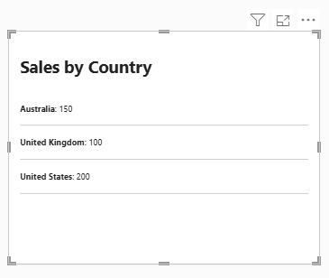

:::warning Optimized for HTML Content 2.0 and Above
This guide is valid for HTML Content 2.0 and above. Earlier versions expose a different property set - templates and several other properties documented here do not exist in 1.x, and Desktop persists a different set of objects for them.
:::

With [Power BI Enhanced Report Format (PBIR)](https://learn.microsoft.com/en-us/power-bi/developer/projects/projects-report?WT.mc_id=DP-MVP-5003712&tabs=v2%2Cdesktop#pbir-format) becoming the default for Power BI reports, this page explains what's needed to make HTML Content features work if you're manually editing or programmatically generating visuals, or using an LLM or other tool to help generate report content (or if you're an LLM reading this page for guidance).

In addition to PBIR, the details on this page may also help you better understand HTML Content's internal structure, for use when building [report themes](https://learn.microsoft.com/en-us/power-bi/create-reports/desktop-report-themes?WT.mc_id=DP-MVP-5003712) that include HTML Content visuals.

## The Short Version {#the-short-version}

It's worth reading the full guide, but if you just want the minimum needed for a working HTML Content visual in PBIR, here it is:

| Path                                          | Value                                                                                                                 |
| --------------------------------------------- | --------------------------------------------------------------------------------------------------------------------- |
| `visual.visualType`                           | `"htmlContent443BE3AD55E043BF878BED274D3A6865"` (Secure) or `"htmlContent443BE3AD55E043BF878BED274D3A6855"` (Regular) |
| `visual.query.queryState.content.projections` | At least one projection in the content role (a measure or column producing HTML)                                      |

Notice what's absent: no `objects` property is mandatory. Many visuals store their content directly in properties, so for those visuals, a bare `visualType` renders nothing useful. HTML Content works differently - its content comes from the data model, not from properties - so a visual with just a content projection renders with default formatting and no `objects` at all.

### Validating Your PBIR Configuration {#validating-your-pbir-configuration}

Before loading your report, check that:

1. All JSON strings are properly escaped.
2. Integer values end with the `D` suffix.
3. Text values are wrapped in single quotes within the `Value` field.
4. Boolean values are set to `true` or `false` as literals.

These rules apply everywhere a property is written as a literal expression - see the [Property Implementation Guide](#property-implementation-guide) below for the full type-by-type breakdown.

## Visual GUIDs {#visual-guids}

All Power BI visuals have a unique identifier (GUID) that identifies the visual type. HTML Content ships two AppSource editions, each with its own GUID:

- Secure (Certified) 🛡️: `htmlContent443BE3AD55E043BF878BED274D3A6865`
- Regular: `htmlContent443BE3AD55E043BF878BED274D3A6855`

The GUID is also what Power BI uses to determine where to look for visual updates. When the GUID matches a published AppSource listing, Power BI retrieves and updates the visual code automatically, so the visual does not need to be committed to your PBIP assets.

Because the two editions have different GUIDs, `visual.visualType` tells you which one a given `visual.json` targets - but it's worth knowing that the same `visual.json` body can render differently between editions, since the Secure edition sanitizes content and the Regular edition does not. See [Sanitization](sanitization) for what that means for your markup.

## Understanding Visual Capabilities {#understanding-visual-capabilities}

Visual [capabilities](https://learn.microsoft.com/en-us/power-bi/developer/visuals/capabilities?WT.mc_id=DP-MVP-5003712) are metadata that form a visual's contract with Power BI: what data roles it exposes, what formatting options it offers, and what interactivity it supports. In PBIR, capabilities are defined in JSON, and Power BI reads them the moment a visual is added to a report to work out how it should integrate with the report environment.

When you configure a visual, the JSON persisted for that instance ties back to this capabilities definition, which is how the visual gets rebuilt from saved state whenever you reopen the page or report.

It's tempting to assume persisted properties behave exactly as their names suggest, but visuals typically apply internal logic on top of these values rather than using them verbatim. This guide documents what actually happens to HTML Content's persisted properties, so you can work with them directly instead of guessing.

HTML Content exposes three data roles: `content` (the **Values** well), `sampling` (the **Context** well), and `tooltips` (the **Tooltips** well). See [Data Roles](data-roles) for what each one does.

## Dissecting the Simplest Scenario {#simplest-scenario}

To see the baseline structure, here's what Desktop persists when a fresh HTML Content visual is dropped onto the canvas with nothing configured - no data, no formatting:

```json title="Visual added manually to report, with no additional configuration or data"
{
  "$schema": "https://developer.microsoft.com/json-schemas/fabric/item/report/definition/visualContainer/2.10.0/schema.json",
  "name": "2e2f2ab85e64e1ec42b8",
  "position": {
    "x": 144,
    "y": 80,
    "z": 0,
    "height": 480,
    "width": 720,
    "tabOrder": 0
  },
  "visual": {
    "visualType": "htmlContent443BE3AD55E043BF878BED274D3A6865",
    "objects": {
      "compatibility": [
        {
          "properties": {
            "legacyRendering": {
              "expr": {
                "Literal": {
                  "Value": "false"
                }
              }
            }
          }
        }
      ]
    },
    "drillFilterOtherVisuals": true
  }
}
```

Most of this is standard PBIR scaffolding - `$schema`, `name`, and `position` are managed by Desktop for every visual, `visualType` identifies the visual as HTML Content, and `drillFilterOtherVisuals` is a report-level setting unrelated to this visual specifically.

The interesting part is `objects.compatibility.legacyRendering`. Desktop persists this the moment the visual is added, before any data is bound - because the visual records its rendering auto-classification decision on first add. A fresh visual has nothing to migrate, so it's classified for modern rendering (`false`); a visual migrated from a pre-2.0 report would instead see `true` written here, preserving how it used to render. See [Compatibility](properties-compatibility) for the full behavior.

If you're creating visuals programmatically, you can omit `objects.compatibility` entirely - the visual re-derives the same classification (modern rendering, since there's nothing to migrate) on load. The equivalent minimal definition:

```json title="Equivalent minimal definition for a fresh HTML Content visual"
{
  "$schema": "https://developer.microsoft.com/json-schemas/fabric/item/report/definition/visualContainer/2.10.0/schema.json",
  "name": "2e2f2ab85e64e1ec42b8",
  "position": {
    "x": 144,
    "y": 80,
    "z": 0,
    "height": 480,
    "width": 720,
    "tabOrder": 0
  },
  "visual": {
    "visualType": "htmlContent443BE3AD55E043BF878BED274D3A6865",
    "drillFilterOtherVisuals": true
  }
}
```

## Adding Content from the Data Model {#adding-content}

This is where HTML Content differs structurally from most other visuals: there's no `jsonSpec`-style property holding the content. The HTML itself lives in the data model, in whatever measure or column you bind to the **Values** well - the visual just renders what comes back.

The example model behind the captures below is a calculated table called `Data`, with three rows and two measures:

```dax
Data =
    DATATABLE (
        "Country", STRING,
        "Sales", INTEGER,
        { { "Australia", 150 }, { "United Kingdom", 100 }, { "United States", 200 } }
    )
```

```dax
Greeting = "<p>Hello, <b>world</b>!</p>"
```

```dax
Country Sales =
    "<p><b>" & SELECTEDVALUE ( 'Data'[Country] ) & "</b>: "
        & FORMAT ( SUM ( 'Data'[Sales] ), "#,0" )
        & "</p>"
```

Adding `[Greeting]` to **Values** produces this `query` block:

```json title="Query state after adding a single measure to Values"
{
  "queryState": {
    "content": {
      "projections": [
        {
          "field": {
            "Measure": {
              "Expression": {
                "SourceRef": {
                  "Entity": "Data"
                }
              },
              "Property": "Greeting"
            }
          },
          "queryRef": "Data.Greeting",
          "nativeQueryRef": "Greeting"
        }
      ]
    }
  }
}
```

The key to notice is `queryState.content` - the name matches the role name (`content`) declared in capabilities, not a generic `dataset` bucket. A visual with just this projection renders the greeting immediately, with default formatting and no `objects` at all - there's nothing else to configure.

Binding a richer example brings in a second role. Here, `[Country Sales]` is renamed to "Sales Summary" in the **Values** well, and `Data[Country]` is added to **Context**:

```json title="Full query section with a renamed measure and a Context column"
{
  "queryState": {
    "content": {
      "projections": [
        {
          "field": {
            "Measure": {
              "Expression": {
                "SourceRef": {
                  "Entity": "Data"
                }
              },
              "Property": "Country Sales"
            }
          },
          "queryRef": "Data.Country Sales",
          "nativeQueryRef": "Sales Summary",
          "displayName": "Sales Summary"
        }
      ]
    },
    "sampling": {
      "projections": [
        {
          "field": {
            "Column": {
              "Expression": {
                "SourceRef": {
                  "Entity": "Data"
                }
              },
              "Property": "Country"
            }
          },
          "queryRef": "Data.Country",
          "nativeQueryRef": "Country"
        }
      ]
    }
  }
}
```

Two things worth calling out:

- Renaming a field in the well updates **both** `nativeQueryRef` and `displayName` to the new name, under schema 2.10 - `nativeQueryRef` isn't the fixed "original name" anchor you might expect from other visuals; it tracks the rename alongside `displayName`.
- `Data[Country]` sits under `queryState.sampling` - the **Context** role - not `content`. One row is produced per distinct combination of values in Context, and `[Country Sales]` re-evaluates against each one via `SELECTEDVALUE`.

See [Data Roles](data-roles) for the full behavior of each role. This is also as far as the guide needs to go on model binding - any measure or column that emits HTML works identically, whether it's a static string like `Greeting` or something dynamic like `Country Sales`.

## Applying Templates {#applying-templates}

Setting the **Body template** and **Row template** properties adds an `objects.templates` block:

```json title="Delta: objects.templates added"
{
  "objects": {
    "compatibility": [
      /* same as previous example */
    ],
    "templates": [
      {
        "properties": {
          "bodyTemplate": {
            "expr": {
              "Literal": {
                "Value": "'<ul>{{content}}</ul>'"
              }
            }
          },
          "rowTemplate": {
            "expr": {
              "Literal": {
                "Value": "'<li>{{row}}</li>'"
              }
            }
          }
        }
      }
    ]
  }
}
```

Both properties are text literals - single-quoted, as with any text property in PBIR. `rowTemplate` renders once per row, wrapping that row's value with `{{row}}` marking where it goes; `bodyTemplate` then renders once, wrapping the joined set of rendered rows with `{{content}}` marking where they're inserted. In this example, each row becomes `<li>...</li>`, and the whole set is wrapped in a `<ul>...</ul>`. See [Templates](properties-templates) for the full property behavior, including how it interacts with legacy rendering.

## Styling with the Stylesheet {#applying-stylesheet}

Setting the **Stylesheet** property adds `objects.stylesheet.stylesheet`. The raw CSS behind this example is:

```css
#htmlContent ul {
  list-style: none;
  padding: 0;
}
#htmlContent li {
  border-bottom: 1px solid var(--pbi-theme-fg-neutral-tertiary);
  padding: 4px 0;
}
```

Once captured in PBIR, the same CSS is stored as a single-quoted text literal, with newlines escaped as `\n`:

```json title="Delta: objects.stylesheet added"
{
  "objects": {
    "compatibility": [
      /* same as previous example */
    ],
    "templates": [
      /* same as previous example */
    ],
    "stylesheet": [
      {
        "properties": {
          "stylesheet": {
            "expr": {
              "Literal": {
                "Value": "'#htmlContent ul {\n    list-style: none;\n    padding: 0;\n}\n#htmlContent li {\n    border-bottom: 1px solid var(--pbi-theme-fg-neutral-tertiary);\n    padding: 4px 0;\n}\n'"
              }
            }
          }
        }
      }
    ]
  }
}
```

That's the general shape for any multi-line text property in PBIR: the whole value stays a single JSON string, with line breaks written as literal `\n` sequences inside the single-quoted literal - not real newlines in the JSON file.

The `--pbi-theme-fg-neutral-tertiary` variable here is one of the report theme's colors, exposed to your stylesheet so borders and text can follow the active theme instead of hard-coded hex values. See [Theme Colors](theme-colors) for the full set of available variables, and [Stylesheet](properties-stylesheet) for what else the property supports.

## Enabling Cross-Filtering {#enabling-cross-filtering}

Turning on the **Enable** toggle under cross-filtering adds `objects.crossFilter` - but only one property inside it:

```json title="Delta: objects.crossFilter added"
{
  "objects": {
    "compatibility": [
      /* same as previous example */
    ],
    "templates": [
      /* same as previous example */
    ],
    "stylesheet": [
      /* same as previous example */
    ],
    "crossFilter": [
      {
        "properties": {
          "enabled": {
            "expr": {
              "Literal": {
                "Value": "true"
              }
            }
          }
        }
      }
    ]
  }
}
```

Only `enabled` is written. The cross-filter card also has `useTransparency` (defaults to `true`) and `transparencyPercent` (defaults to `70`), but neither was touched in this example, so neither is persisted - Desktop only writes values that differ from the default. This is worth internalizing generally: a property's absence in captured JSON doesn't mean it's off or unset; it means it's still at its default. The [Properties Reference](#properties-reference) below documents all three defaults explicitly.

With cross-filtering enabled and `Data[Country]` bound to Context, clicking a rendered row cross-filters the rest of the report by that row's Context fields. See [Interactivity](interactivity) for the full behavior, including unselected-item styling.

## Driving Properties from Measures (fx) {#fx-bound-properties}

Body template, Stylesheet, and the "No Data" message all support fx (conditional formatting) binding, so their values can come from a measure instead of a fixed literal. Binding the body template to a measure swaps the `Literal` expression for a `Measure` one:

```json title="Delta: bodyTemplate bound to a measure via fx"
{
  "objects": {
    "compatibility": [
      /* same as previous example */
    ],
    "templates": [
      {
        "properties": {
          "bodyTemplate": {
            "expr": {
              "Measure": {
                "Expression": {
                  "SourceRef": {
                    "Entity": "Data"
                  }
                },
                "Property": "Body Template Measure"
              }
            }
          },
          "rowTemplate": {
            "expr": {
              "Literal": {
                "Value": "'<li>{{row}}</li>'"
              }
            }
          }
        }
      }
    ],
    "stylesheet": [
      /* same as previous example */
    ],
    "crossFilter": [
      /* same as previous example */
    ]
  }
}
```

`rowTemplate` is untouched, still a `Literal` - only `bodyTemplate` moved to a `Measure` expression, referencing the `Data` entity and a `Body Template Measure` property:

```dax
Body Template Measure =
    "<header><h2>Sales by Country</h2></header>{{content}}"
```

The shape mirrors the projections you already saw under `query` - `Expression.SourceRef.Entity` names the table, `Property` names the measure. When bound this way, the measure's returned value is used in place of any literal, so the template can react to filters, slicers, or any other model logic the measure evaluates against. The same binding pattern applies to the Stylesheet property.

The type-by-type breakdown of these expression shapes - what changes for text, integers, booleans, and measure bindings - is covered in the [Property Implementation Guide](#property-implementation-guide) further down this page.

With every stage applied, the finished visual renders the templated, styled country list with cross-filtering enabled and the fx-bound body template providing the heading:



## Properties Reference {#properties-reference}

The following sections cover every property in each `objects` group HTML Content persists, with its default value if omitted, its type, and what it does.

When writing these properties, remember the container shape from the walkthrough samples: each group under `visual.objects` is an array whose single element holds a `properties` bag, so a property lives at `visual.objects.<group>[0].properties.<property>.expr`.

:::tip May Also Be Useful for Theming
Some of these properties matter beyond the visuals you generate directly - knowing their defaults can help when building [report themes](https://learn.microsoft.com/en-us/power-bi/create-reports/desktop-report-themes?WT.mc_id=DP-MVP-5003712) that include HTML Content visuals, or when priming a template so new visuals start from sensible defaults.
:::

### objects.contentFormatting {#objects-contentformatting}

Properties in this group appear under [Content Formatting](properties-content-formatting) in the format pane - the renderer, default body styling, and safety toggles that control how bound content is displayed.

| Property                | Default Value (if Omitted)                                         | Type                                             | Remarks                                                                                                                                                                                                                                                                                                                                             |
| ----------------------- | ------------------------------------------------------------------ | ------------------------------------------------ | --------------------------------------------------------------------------------------------------------------------------------------------------------------------------------------------------------------------------------------------------------------------------------------------------------------------------------------------------- |
| `showRawHtml`           | `false`                                                            | [boolean](#boolean)                              | Labeled **Show raw HTML** in the format pane. Displays the data as raw HTML text rather than rendering it.                                                                                                                                                                                                                                          |
| `enableDiagnostics`     | `false`                                                            | [boolean](#boolean)                              | Labeled **Enable diagnostics** in the format pane. The only author-facing gate for the Diagnostics dialog (Desktop and Service only) - it doesn't change rendered output.                                                                                                                                                                           |
| `format`                | `'html'`                                                           | [text](#text) (enum)                             | Labeled **Renderer** in the format pane. The renderer applied to supplied content: `html` ("HTML") or `markdown` ("Markdown", GitHub Flavored). HTML is the default.                                                                                                                                                                                |
| `renderMode`            | `'rebuild'`                                                        | [text](#text) (enum)                             | Labeled **On data update** in the format pane. Controls how the visual updates the DOM when the dataset (or a volatile property) changes: `rebuild` ("Rebuild content") redraws everything on each update; `reconcile` ("Preserve unchanged content") keeps entries whose value hasn't changed, so embedded content such as iframes doesn't reload. |
| `fontFamily`            | `'\'Segoe UI\', wf_segoe-ui_normal, helvetica, arial, sans-serif'` | [text](#text) (formatting: font family)          | Labeled **Font family** in the format pane. Default body font family, applied only when the bound HTML has no overriding inline style - see `overrideInlineStyling` below.                                                                                                                                                                          |
| `fontSize`              | `11D`                                                              | [integer](#integer) (formatting: font size, pt)  | Labeled **Font size** in the format pane. Default body font size in points; slider bounds are `8D` to `32D`. Same "no overriding inline style" condition as `fontFamily`.                                                                                                                                                                           |
| `fontColour`            | `'#000000'`                                                        | [color](#color)                                  | Labeled **Font color** in the format pane. Default body font color, same condition as `fontFamily`/`fontSize`. Note the UK spelling - the persisted property name is `fontColour`, not `fontColor`.                                                                                                                                                 |
| `align`                 | `'left'`                                                           | [text](#text) (formatting: horizontal alignment) | Labeled **Text alignment** in the format pane, in the horizontal alignment group. One of `'left'`, `'center'`, or `'right'` - the persisted value is applied verbatim as the CSS `text-align` keyword. Default body text alignment, same condition as the other default-body-styling properties above.                                              |
| `overrideInlineStyling` | `false`                                                            | [boolean](#boolean)                              | Labeled **Override inline styling** in the format pane. Off by default, so author intent (inline `style` attributes in the bound HTML) wins. When on, forces `fontFamily`, `fontSize`, `fontColour`, and `align` to override inline styling - a paste-cleanup mode. Has no effect when a stylesheet is in use.                                      |
| `hyperlinks`            | `false`                                                            | [boolean](#boolean)                              | Labeled **Allow opening URLs** in the format pane. Allows hyperlinks to be opened using the visual host, which delegates the navigation request to Power BI and prompts the user for consent.                                                                                                                                                       |
| `userSelect`            | `false`                                                            | [boolean](#boolean)                              | Labeled **Allow text select** in the format pane. Allows text to be selected with the mouse rather than the visual's standard selection behavior.                                                                                                                                                                                                   |
| `noDataMessage`         | `'No data available to display'`                                   | [text](#text)                                    | Labeled **"No Data" message** in the format pane (the group heading doubles as the label, since it's the only property in its group). Shown when no rows are bound. Supports [fx](#fx-bound-properties) binding to a measure.                                                                                                                       |

### objects.stylesheet {#objects-stylesheet}

Properties in this group cover the [Stylesheet](properties-stylesheet) property, plus one declared-but-unused capability.

| Property     | Default Value (if Omitted) | Type          | Remarks                                                                                                                                                                                                                                                                                                               |
| ------------ | -------------------------- | ------------- | --------------------------------------------------------------------------------------------------------------------------------------------------------------------------------------------------------------------------------------------------------------------------------------------------------------------- |
| `stylesheet` | `''` (empty)               | [text](#text) | Labeled **Stylesheet** (the card title doubles as the label) in the format pane. Custom CSS applied to the HTML body. Supports [fx](#fx-bound-properties) binding to a measure.                                                                                                                                       |
| `test`       | -                          | -             | Declared in the visual's capabilities but never wired to a format-pane slice, a default, or any read/write logic in the visual's code. It is not used by the visual - it's a dead, orphaned capability declaration left over from an earlier refactor, not a "managed by the visual" internal setting. Do not set it. |

### objects.templates {#objects-templates}

Properties in this group cover the [Templates](properties-templates) properties that wrap rendered rows and the body around them.

| Property       | Default Value (if Omitted) | Type          | Remarks                                                                                                                                                                                                                                                                                                                                                                                                                                                                                                                                                                                                                                        |
| -------------- | -------------------------- | ------------- | ---------------------------------------------------------------------------------------------------------------------------------------------------------------------------------------------------------------------------------------------------------------------------------------------------------------------------------------------------------------------------------------------------------------------------------------------------------------------------------------------------------------------------------------------------------------------------------------------------------------------------------------------- |
| `bodyTemplate` | `'{{content}}'`            | [text](#text) | Labeled **Body template** in the format pane. HTML wrapped around all rows once; the `{{content}}` token marks where the rendered rows are inserted. Supports [fx](#fx-bound-properties) binding to a measure.                                                                                                                                                                                                                                                                                                                                                                                                                                 |
| `rowTemplate`  | `''` (empty)               | [text](#text) | Labeled **Row template** in the format pane. The pane shows a placeholder of `'<div><div>{{row}}</div></div>'`, but that's UI placeholder text, not the persisted default. When left empty, the effective template at render time falls back to a built-in chosen by `compatibility.legacyRendering`: `'<div><div>{{row}}</div></div>'` under legacy rendering, `'<div>{{row}}</div>'` under modern rendering (the default). A non-empty authored value always wins in either mode. Unlike `bodyTemplate` and `stylesheet`, this property does not support fx binding - per-row variation instead comes from the bound content measure itself. |

### objects.crossFilter {#objects-crossfilter}

Properties in this group cover the [Interactivity](interactivity) properties that control cross-filtering behavior and the appearance of unselected items.

| Property              | Default Value (if Omitted) | Type                | Remarks                                                                                                                                                                                                                                                 |
| --------------------- | -------------------------- | ------------------- | ------------------------------------------------------------------------------------------------------------------------------------------------------------------------------------------------------------------------------------------------------- |
| `enabled`             | `false`                    | [boolean](#boolean) | Labeled **Enable** in the format pane. Enables cross-filtering of other visuals when Context is provided. The card is hidden entirely in the pane when the view model has no context columns.                                                           |
| `useTransparency`     | `true`                     | [boolean](#boolean) | Labeled **Set transparency of unselected items** in the format pane. Toggles a `.htmlViewerEntry.unselected { opacity: ... }` rule. Only visible in the pane when `enabled` is on. Alternatively, style `.unselected` manually via a custom stylesheet. |
| `transparencyPercent` | `70D`                      | [integer](#integer) | Labeled **Transparency** in the format pane. The transparency percentage applied to unselected items; valid values are `0D` to `100D`. Only visible in the pane when both `enabled` and `useTransparency` are on.                                       |

### objects.compatibility {#objects-compatibility}

Properties in this group cover the single [Compatibility](properties-compatibility) property that determines whether a visual renders using legacy (v1) or modern rules.

| Property          | Default Value (if Omitted) | Type                | Remarks                                                                                                                                                                                                                                                                                                                                                                                                                                                                                                                     |
| ----------------- | -------------------------- | ------------------- | --------------------------------------------------------------------------------------------------------------------------------------------------------------------------------------------------------------------------------------------------------------------------------------------------------------------------------------------------------------------------------------------------------------------------------------------------------------------------------------------------------------------------- |
| `legacyRendering` | `false`                    | [boolean](#boolean) | Labeled **Use legacy (v1) rendering** in the format pane. The persisted value doubles as a version marker: it's decided once, on first add or open, and then stamped and persisted - a fresh visual has nothing to migrate and is classified `false`; a visual migrated from a pre-2.0 report is classified `true`, preserving how it used to render (see [Dissecting the Simplest Scenario](#simplest-scenario) above for a worked example). From then on it behaves like any other property, and can be flipped manually. |

## Property Implementation Guide {#property-implementation-guide}

The PBIR documentation does not elaborate on property specifics very well, so here are some notes on the types you'll run into when authoring HTML Content properties directly as JSON. This covers how HTML Content uses them, not the entire PBIR property system.

### Common Pitfalls {#common-pitfalls}

1. **A numeric property fails to parse** - almost always means the `D` suffix is missing; Power BI requires it on every numeric literal.
2. **Double-escaping JSON, CSS, or HTML** inside a text literal - produces mangled output or a parse error, since the value is already escaped once for JSON.
3. **A text property is silently ignored or errors on load** - check the quoting first; the `Value` field expects a single-quoted string, and double quotes there won't parse as intended.
4. **Missing the `expr.Literal.Value` wrapper** - the property isn't recognized as a valid expression and is ignored.
5. **Authoring content the Secure edition sanitizes away** - markup that renders fine in the Regular edition can disappear in Secure. See [Sanitization](sanitization) for what gets stripped and why.
6. **Expecting `objects` to hold the content itself** - it doesn't. The HTML lives in the data model, in whatever measure or column is bound to **Values** (see [Adding Content from the Data Model](#adding-content)); `objects` only holds presentation and behavior settings.

### boolean {#boolean}

Boolean properties use `true` or `false` literals. For example, to set **Allow opening URLs** (`hyperlinks`) to `true`:

```json title="Boolean property structure"
{
  "hyperlinks": {
    "expr": {
      "Literal": {
        "Value": "true"
      }
    }
  }
}
```

This is the same shape captured for `crossFilter.enabled` in the [cross-filtering walkthrough](#enabling-cross-filtering) above.

### color {#color}

HTML Content has one color property, `fontColour`, and it follows the `solid.color` fill structure used across Power BI visuals rather than a bare `Literal`. The value itself is still a text literal - single-quoted - and it supports any HTML/CSS color format. To set `fontColour` to red:

```json title="Color property structure using a Literal value"
{
  "fontColour": {
    "solid": {
      "color": {
        "expr": {
          "Literal": {
            "Value": "'#FF0000'"
          }
        }
      }
    }
  }
}
```

The same nesting also accepts a `ThemeDataColor` expression in place of `Literal`, binding the property to a color in the report theme's palette instead of a fixed value:

```json title="Color property structure bound to the report theme"
{
  "fontColour": {
    "solid": {
      "color": {
        "expr": {
          "ThemeDataColor": {
            "ColorId": 1,
            "Percent": 0
          }
        }
      }
    }
  }
}
```

`ColorId` indexes into the theme's color palette; `Percent` lightens (positive) or darkens (negative) the selected color.

### integer {#integer}

Integer values are suffixed with `D` to mark them as numeric literals - without it, Power BI fails to parse the value. For example, to set **Transparency** (`transparencyPercent`) to `50`:

```json title="Integer property structure"
{
  "transparencyPercent": {
    "expr": {
      "Literal": {
        "Value": "50D"
      }
    }
  }
}
```

### text {#text}

Text properties are wrapped in single quotes (`'`) within the `Value` field. Any JSON, HTML, or CSS stored in a text property is stringified and escaped inside those single quotes, exactly like any other string content - [the stylesheet stage](#applying-stylesheet) above is the worked example of that escaping transform, including how newlines become literal `\n` sequences. A simpler case - setting **"No Data" message** (`noDataMessage`) to `'No rows to display'`:

```json title="Text property structure"
{
  "noDataMessage": {
    "expr": {
      "Literal": {
        "Value": "'No rows to display'"
      }
    }
  }
}
```

### Measure-bound (fx) properties {#fx-expression}

When a property is bound to a measure instead of a fixed value, `expr` carries a `Measure` object in place of `Literal`. `Expression.SourceRef.Entity` names the model table the measure belongs to, and `Property` names the measure itself:

```json title="Generalized shape for a measure-bound property"
{
  "<property>": {
    "expr": {
      "Measure": {
        "Expression": {
          "SourceRef": {
            "Entity": "<table>"
          }
        },
        "Property": "<measure name>"
      }
    }
  }
}
```

The concrete case from [the fx walkthrough stage](#fx-bound-properties) - `bodyTemplate` bound to a measure called `Body Template Measure` on the `Data` table:

```json title="bodyTemplate bound to a measure, from the fx walkthrough capture"
{
  "bodyTemplate": {
    "expr": {
      "Measure": {
        "Expression": {
          "SourceRef": {
            "Entity": "Data"
          }
        },
        "Property": "Body Template Measure"
      }
    }
  }
}
```

Three properties support this binding: `bodyTemplate`, `stylesheet`, and `noDataMessage`. `rowTemplate` does not - per-row variation comes from the bound content measure itself, not from a second fx-bound template.
