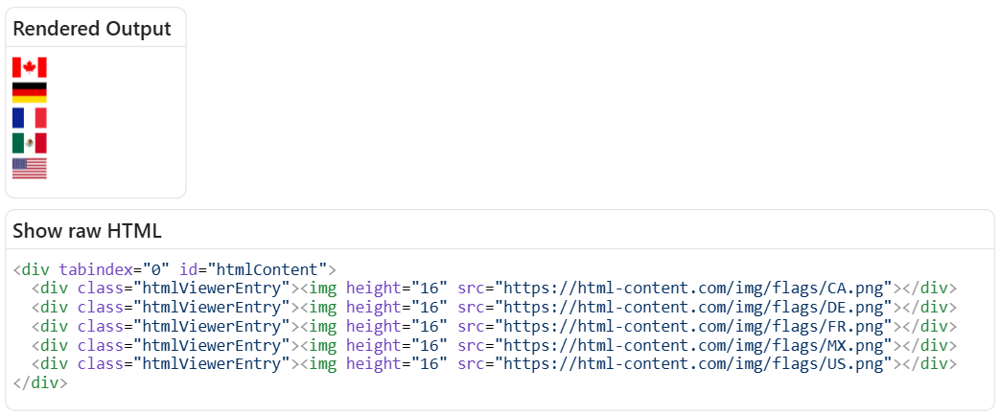
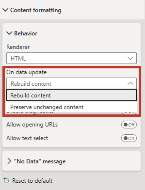

# Content Formatting

The **Content formatting** property menu can be used to manage some aspects of the visual's appearance to the end-user.

## Behavior

### Renderer

You have a choice of renderer for your content, either **HTML** or **Markdown**.

- **HTML** is the default and is the typical renderer that most people will need.
- **Markdown** will treat the content as markdown before further applying HTML rendering.
- The renderer will cover Markdown 1.0, and most of GitHub Flavored Markdown and CommonMark. You can review the [renderer documentation (Marked)](https://marked.js.org/#specifications) to see what might not work.
- Anything that looks like valid HTML after markdown pre-processing will be rendered using the HTML renderer. If using HTML Content Secure, this will be sanitized as normal.

### Show raw HTML

By default, the visual will attempt to render any content in the **Values** data role. However, if you want to check the generated HTML, you can enable this to confirm everything is as intended, e.g.:



- This area is scrollable, and it is possible to select text and copy to the clipboard with **Ctrl + C** (or your system's assigned shortcut).
- The raw HTML will also include the `<div>` used to encapsulate all body content, and the `<div>` used to encapsulate individual rows from the visual dataset, which may also help with identifying how the DOM is structured, and for identifying CSS selectors for standard elements.
- If a stylesheet has been assigned via visual properties, the resolved CSS will also be included in a `<style>` tag.
- Large output degrades gracefully to stay responsive: above ~200 KB the HTML is shown as plain (un-highlighted) text, and above ~512 KB it is truncated and no longer pretty-print-indented. The [Diagnostics dialog's Raw HTML tab](diagnostics#raw-html-tab) shows the same processed HTML with the same caps, plus a **Copy** button.

### Allow opening URLs

Custom visuals are prevented from directly opening hyperlinks or external URLs on behalf of the user, as this is potentially malicious behavior if done without any visible effect. However, custom visuals can request that Power BI open a URL on their behalf.

- Enabling the **Allow Opening URLs** property will delegate the request to open the hyperlink to Power BI. If permitted, this will prompt the user for their consent to navigate to this URL, e.g.:

  

- Only `http://` and `https://` protocols are supported for custom visuals. This means that other protocols, such as `javascript:`, `ftp://`, `mailto:`, `file://` will result in an error, e.g.:

  

- In **HTML Content Secure**, this property also controls whether the `href` attribute is present in the rendered output at all. When the property is disabled (the default), the sanitizer strips `href` (and `xlink:href`) from every `<a>` element, not just the click behavior - this is required for certification. See [Sanitization > URL schemes](sanitization#url-schemes) for the full rule. The regular edition leaves the attribute in place and only manages the click.

### Allow text select

While Power BI has a **Copy** option in the context menu, this only applies to the entire visual and not specific content within it. Therefore you can enable this option to allow users to highlight text using their mouse.

Highlighted text can be copied to the clipboard with **Ctrl + C** (or system equivalent).

### On data update {#on-data-update}

:::info New in 2.0
This property was added in version 2.0. Refer to the [change log](change-log) for full release details.
:::

Controls how the visual updates the DOM when the data (or a volatile property) changes:

- **Rebuild content** - everything is re-parsed and re-inserted on each update. Simple and predictable; any embedded iframe, input, or script re-runs.
- **Preserve unchanged content** - entries whose value hasn't changed keep their existing DOM, so embedded iframes don't reload, form inputs keep their state, and per-row scripts don't re-run. Only changed entries are re-rendered.

Choose **Preserve unchanged content** when your rows hold stateful or expensive embedded content; choose **Rebuild content** when you want a clean redraw each time. If you are [scripting in the Regular edition](scripting#execution-model), this property determines which scripts re-run on update.



### Enable diagnostics {#enable-diagnostics}

:::info New in 2.0
This property was added in version 2.0. Refer to the [change log](change-log) for full release details.
:::

Turns on the visual's [Diagnostics](diagnostics) surface - a dialog showing the processed raw HTML, sanitizer removals (Secure edition), captured console output, and a log of host events.

The toggle persists with the report, but the diagnostics icon and capture are only active while editing in Power BI Desktop or Service - report consumers never see them.

## "No Data" message

In the event of no data being returned, you can use this property to customize what's displayed to your users, e.g.:


The property has also been enabled to make use of conditional formatting. If you so wish, you could use a measure containing HTML-based formatting instead, e.g.:

```dax
<HTML> No Data = "
    <hr/>
    
    <hr/>"
```


If you want to apply styling to this element, it is rendered as a child `<div>` of the `#statusMessage` element in the DOM.

## Default body styling

### Font family

This property will apply the specified `font-family` to the visual's body, if there is no overriding styling applied to the HTML content - either in an element's inline `style` attribute, or in a `<style>` tag if using one of those in your expressions.

### Font size

This property will apply the specified `font-size` to the visual's body, if there is no overriding styling applied to the HTML content - either in an element's inline `style` attribute, or in a `<style>` tag if using one of those in your expressions.

### Font color

This property will apply the specified `color` to the visual's body, if there is no overriding styling applied to the HTML content - either in an element's inline `style` attribute, or in a `<style>` tag if using one of those in your expressions.

### Text alignment

This property will apply the specified `text-align` to the visual's body, if there is no overriding styling applied to the HTML content - either in an element's inline `style` attribute, or in a `<style>` tag if using one of those in your expressions.

### Override inline styles

By default, the four body-styling properties above are only applied when there is no overriding inline `style` attribute on your HTML content. This works for content with deliberate inline styling, but content produced by applications like **Word**, **Outlook**, or **Teams** embeds inline `style` declarations on almost every element it emits - which silently overrides the body styling you have configured on the visual.

Enabling **Override inline styles** tells the visual to propagate the body-styling values through the DOM, overriding any inline `style` declarations for `color`, `font-family`, `font-size`, and `text-align`. Other inline styles (margins, borders, custom classes, and anything else not in that list) are left intact.

- Disabled by default.
- This is a coarse override - it cannot pick and choose which inline styles to keep. If you need fine-grained control over which inline styles win, supply a [custom stylesheet](properties-stylesheet) instead. A custom stylesheet always takes precedence over both inline styles and this toggle.
- For the mechanics of how the override is applied (and how the Secure edition handles inline styles in general), see [Default body styling](sanitization#default-body-styling) on the Sanitization page.
