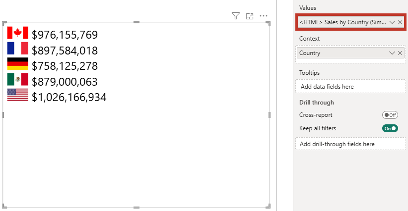

# Stylesheet

The **Stylesheet** property menu lets you add CSS at the top level, rather than managing styling in-line or contextually. You can do this either by using a measure (via conditional formatting) or by providing a CSS definition manually. As of 2.0, the [Body template](properties-templates#body-template) can be driven by a measure in the same way.

If you're using [Context](data-roles#granularity) (which uses div elements to separate rows), you can change the display behavior to create alternate layouts.

## Short DOM Overview

If we refer back to [our example from earlier](simple-example#option-1-create-context-using-granularity), this has one entry per value of **[Country]**, e.g.:



The body is contained in a `div` element with an `id` value of `htmlContent`. Each row in the visual dataset is contained within a `div` element with the class name `htmlViewerEntry`.

:::note Migrated (legacy-rendered) visuals
Visuals using [legacy (v1) rendering](properties-compatibility) (enabled automatically for reports migrated from v1.x) wrap each row in an extra `<div>` (`<div class="htmlViewerEntry"><div>...</div></div>`). Selectors like `.htmlViewerEntry > div` only match in that mode, or with a matching authored [Row template](properties-templates#row-template).
:::

The CSS selectors for these elements are `#htmlContent` and `.htmlViewerEntry` respectively, and this can be confirmed by inspecting the raw HTML (using the [Show Raw HTML](properties-content-formatting#show-raw-html) property).

:::tip
Layouts can be even more flexible with body/row template configuration. Refer to the [Templates](properties-templates) page for more details on understanding the HTML Content DOM.
:::

## Making CSS Changes

For example, to change the flag layout to horizontal and display a background, we could create a measure like the following:

```dax
<CSS> Horizontal Flag = "
    #htmlContent {
        width: 100%;
        display: flex;
        flex-direction: row;
        justify-content: center;
    }
    .htmlViewerEntry {
        width: 100px;
        margin: 5px;
        padding: 5px;
        background-color: #eaeaea;
    }"
```

...and add this to the **Stylesheet** property in the properties pane using conditional formatting to achieve the following result:


If we use the [Show Raw HTML](properties-content-formatting#show-raw-html) property or [Diagnostics](diagnostics), the stylesheet and output are combined for debugging, or to copy/paste elsewhere, e.g.:

```html
<style id="visualUserStylesheet" name="visualUserStylesheet" type="text/css">
  #htmlContent {
    width: 100%;
    display: flex;
    flex-direction: row;
    justify-content: center;
  }

  .htmlViewerEntry {
    width: 100px;
    margin: 5px;
    padding: 5px;
    background-color: #eaeaea;
  }
</style>
<div id="htmlContent">
  <div class="htmlViewerEntry">
    
    <b>$24,887,655</b>
  </div>
  <div class="htmlViewerEntry">
    
    <b>$24,354,172</b>
  </div>
  <div class="htmlViewerEntry">
    
    <b>$23,505,341</b>
  </div>
  <div class="htmlViewerEntry">
    
    <b>$20,949,352</b>
  </div>
  <div class="htmlViewerEntry">
    
    <b>$25,029,830</b>
  </div>
</div>
```

:::info Stylesheet settings override simple content settings
If using the stylesheet property, the [styling options](properties-content-formatting#font-family) in the **Content formatting** menu are disabled and not applied to your output, so as to give you more explicit control and avoid potential conflicts that might otherwise arise.
:::

## Additional Things to Consider

- You can also consume the report theme's palette in your stylesheet via [theme color variables](theme-colors) - no hard-coded hex values required.
- If commenting, remember that these should match the [CSS specification](https://developer.mozilla.org/en-US/docs/Web/CSS/Comments) (block comments). [See the FAQ for what can go wrong here](faq#style-block-disappeared), especially if using the certified edition.
