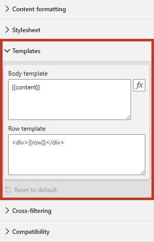

# Templates

:::info New in 2.0
Templates were added in version 2.0. Refer to the [change log](change-log) for full release details.
:::

Templates let you separate the **shell** around your rows from the **content** of each row, so your measures only need to produce per-row markup.



## Body Template {#body-template}

The body template wraps _all_ rows. Put your header, grid or container element, and any shared `<style>` blocks (if not using the [stylesheet](properties-stylesheet)) here. Mark where the rows are injected with the `{{content}}` token, e.g.:

```html
<h1>Sales by Country</h1>
<div class="rows">{{content}}</div>
```

The body template can be static text, or driven by a measure - click the _fx_ (conditional formatting) button on the property to bind it to a measure, so the shell can react to your data. The [Stylesheet](properties-stylesheet) property supports the same binding.

## Row Template {#row-template}

The row template wraps _each_ row. The `{{row}}` token marks where that row's value goes, e.g.:

```html
<div class="card">{{row}}</div>
```

Use `{{row}}` on its own when your per-row measure already returns the row's outer element.

An authored row template always takes precedence over the default row structure - even when [legacy (v1) rendering](properties-compatibility) is enabled.

## Render Order {#render-order}

The body template renders first, then the rows. If you are using scripting in the Regular edition, define shared functions in the body template; per-row scripts can then call them - see [Scripting](scripting) for the recommended pattern.

## Putting It Together

A typical layout using both templates:

1. Write a per-row measure that returns one row's HTML, and return `BLANK()` for rows you don't want rendered - the visual drops them instead of leaving an empty slot.
2. Bind the data - the measure goes in **Values** and your grouping column in [**Context**](data-roles#granularity).
3. Set the **Body template**, including `{{content}}` where the rows go.
4. Set the **Row template** - `{{row}}` if the measure returns the row's outer element already.
5. Optionally add a [Stylesheet](properties-stylesheet), and [enable cross-filtering](interactivity#cross-filtering) so a click on an entry filters the rest of the report.

You can refer to the [Simple Worked Example](simple-example) for a walkthrough of this, with a downloadable sample workbook.
