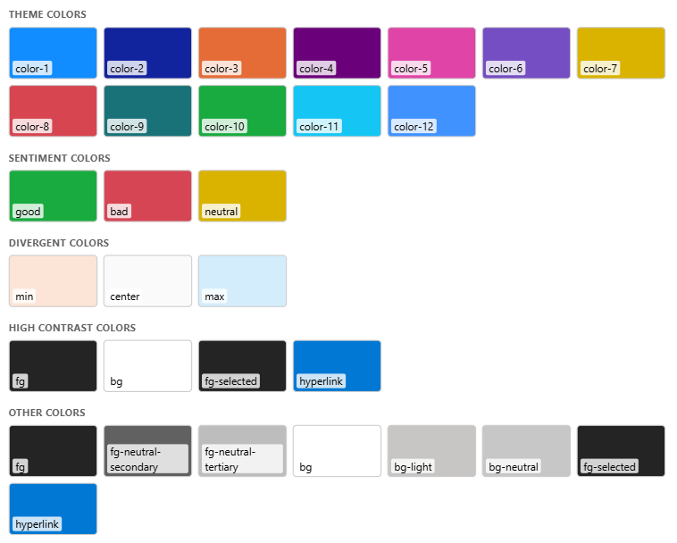

# Theme Colors

:::info New in 2.0
Theme color variables were added in version 2.0. Refer to the [change log](change-log) for full release details.
:::

The visual exposes the report's **active theme palette** as `--pbi-theme-*` CSS custom properties, so your content and [stylesheet](properties-stylesheet) can use the theme's colors without hard-coding hex values. They are defined on the document `:root`, so they are available throughout your content, and they refresh automatically when the report theme - or Windows high contrast - changes.

This is plain CSS, so it works in **every edition** (`var()` survives the Secure edition's sanitizer) - no scripting required.

Use the variables anywhere you'd write a color:

```css
.kpi {
  color: var(--pbi-theme-color-1);
}
.kpi.down {
  color: var(--pbi-theme-bad);
}
.card {
  background: var(--pbi-theme-bg);
  border-color: var(--pbi-theme-fg-neutral-tertiary);
}
```

Always give a **fallback** - a theme needn't define every slot, and a variable is emitted only when the theme actually provides that color:

```css
color: var(--pbi-theme-color-9, var(--pbi-theme-fg, #333));
```

Here's how content styled with these variables looks under the default Power BI theme:



## Available Variables {#available-variables}

Names mirror the theme JSON keys:

| Group       | Variables                                                                                                                                                                                                       |
| ----------- | --------------------------------------------------------------------------------------------------------------------------------------------------------------------------------------------------------------- |
| Data colors | `--pbi-theme-color-1` … `--pbi-theme-color-N` - 1-indexed, matching the theme's "Color 1…N"; `N` varies by theme                                                                                                |
| Structural  | `--pbi-theme-fg`, `--pbi-theme-fg-neutral-secondary`, `--pbi-theme-fg-neutral-tertiary`, `--pbi-theme-bg`, `--pbi-theme-bg-light`, `--pbi-theme-bg-neutral`, `--pbi-theme-fg-selected`, `--pbi-theme-hyperlink` |
| Sentiment   | `--pbi-theme-good`, `--pbi-theme-bad`, `--pbi-theme-neutral`                                                                                                                                                    |
| Divergent   | `--pbi-theme-min`, `--pbi-theme-center`, `--pbi-theme-max`                                                                                                                                                      |

## High Contrast {#high-contrast}

When Windows high contrast is active, the visual adds the class `pbi-theme-hc` to `#htmlContent` (you'll also see it at the top of the [Show raw HTML](properties-content-formatting#show-raw-html) view). Branch on it in pure CSS:

```css
.badge {
  background: var(--pbi-theme-color-3);
}
.pbi-theme-hc .badge {
  background: var(--pbi-theme-bg);
  color: var(--pbi-theme-fg);
}
```

In high contrast, only four colors are guaranteed meaningful - Microsoft's HC-safe set: `--pbi-theme-fg`, `--pbi-theme-bg`, `--pbi-theme-fg-selected`, and `--pbi-theme-hyperlink`.

### Forced Colors {#forced-colors}

High contrast also switches the browser into _forced-colors_ mode, which replaces the author's `background-color` / `color` with the operating system's palette.

- The theme variables still hold the correct high-contrast values, but the browser won't _paint_ `background: var(--pbi-theme-*)` unless you opt the element out with `forced-color-adjust: none`.
- Respect this by default - it is an accessibility feature - and override it only for narrow cases where you must drive the color yourself, then stick to the HC-safe set above.

## Good to Know

- **No variable → text.** CSS can't render a variable's resolved value as text. In the Regular edition, a script can read it - see [Reading theme colors in script](scripting#reading-theme-colors).
- **Iframes.** An inline `srcdoc` iframe is a separate document - the variables and the `pbi-theme-hc` class do not reach inside it. Style that content directly instead.
